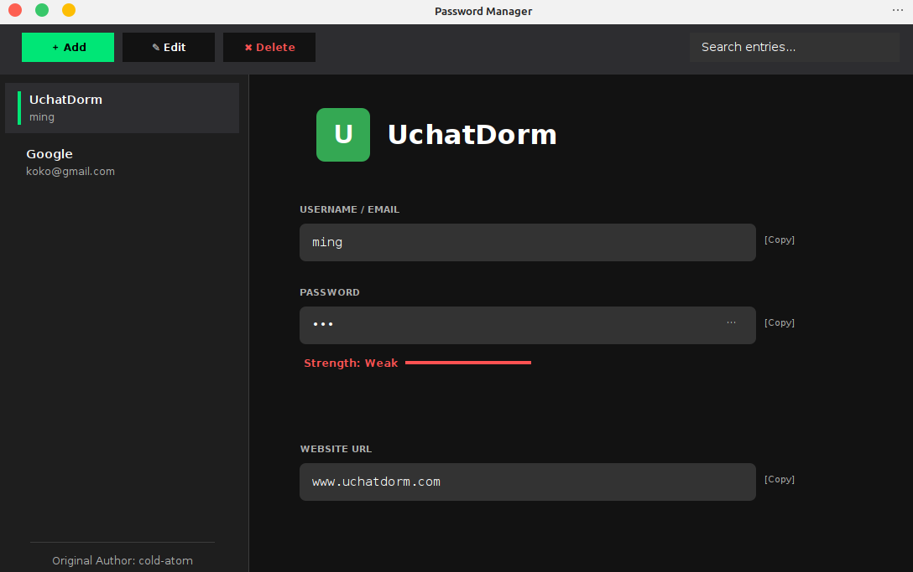
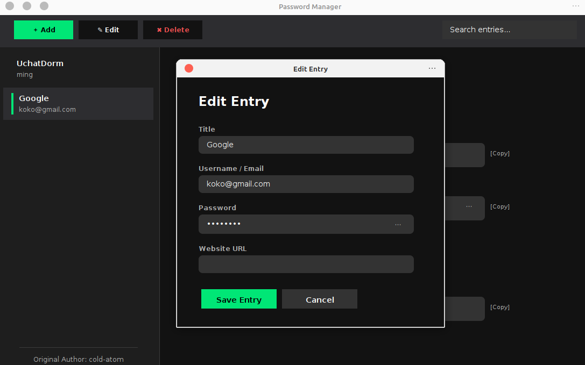

# Password Manager

A small Java Swing password manager I built for my Java class final assignment.

This is a short, simple, fun little project that stores login entries locally in a desktop app with a clean dark UI. I decided to put it on GitHub in case it helps someone who is learning Java, Swing, file handling, or basic encryption ideas.

## What This Project Does

This app lets you:
- add password entries
- edit existing entries
- delete entries
- search by title or username
- view saved account details in a simple dashboard
- store passwords in a local CSV file with basic Vigenere-cipher-based encryption

It is designed for learning and demonstration, not for serious production security.

## Screenshots

| Main Dashboard | Entry Form |
| --- | --- |
|  |  |

The app uses a dark desktop-style layout with a searchable sidebar, a detail panel, and a simple add/edit dialog.

## Built With

- Java
- Java Swing
- local CSV storage
- a custom Vigenere cipher utility

## Project Structure

- `src/PasswordVault.java` - main app window and UI logic
- `src/EntryDialog.java` - add/edit dialog
- `src/PasswordEntry.java` - password entry model and CSV conversion
- `src/VigenereCipher.java` - encryption/decryption helper

## How To Run

### 1. Clone the project

```bash
git clone <your-repo-url>
cd Java-Password-Manager
```

### 2. Create a `.env` file in the project root

Create `.env` in the project root directory, not inside `src/`.

```env
VIGENERE_KEY=your-secret-key-here
```

If no `.env` file is found, the app falls back to a default key.

### 3. Compile and run

```bash
cd src
javac PasswordVault.java PasswordEntry.java EntryDialog.java VigenereCipher.java
java PasswordVault
```

## What To Expect

When the app starts, it loads entries from a local `vault.csv` file if one exists. From there you can:
- create a new entry with title, username, password, and URL
- click an item in the sidebar to view its details
- search entries live from the top search bar
- edit or delete entries from the toolbar
- reveal or copy stored values from the detail panel

If `vault.csv` does not exist yet, the app will simply start with an empty vault.

## Important Note

This project is mainly for coursework and learning.

It uses a Vigenere cipher to avoid storing passwords as plain text in the CSV file, but it is not meant to be a fully secure or production-ready password manager. If you need real password protection, use a well-established password manager with modern encryption and security practices.
